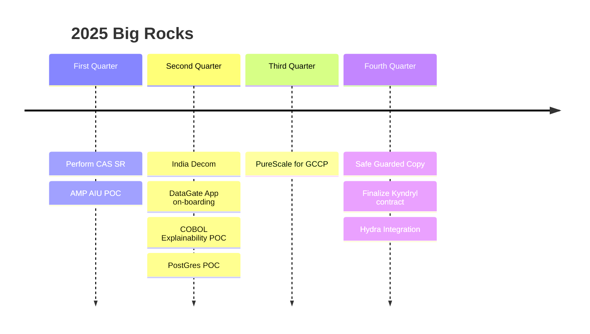
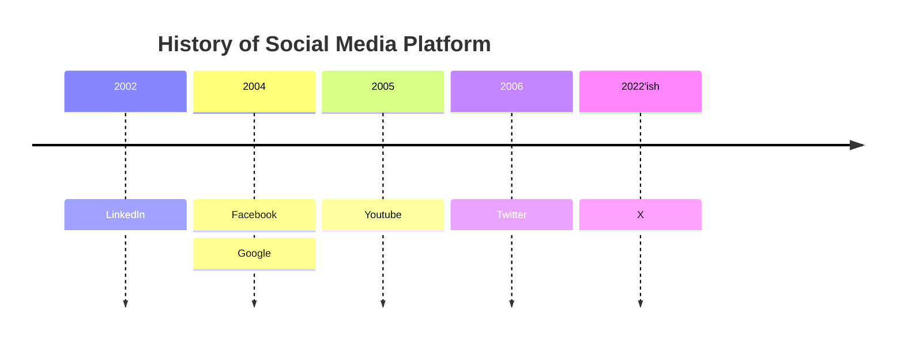
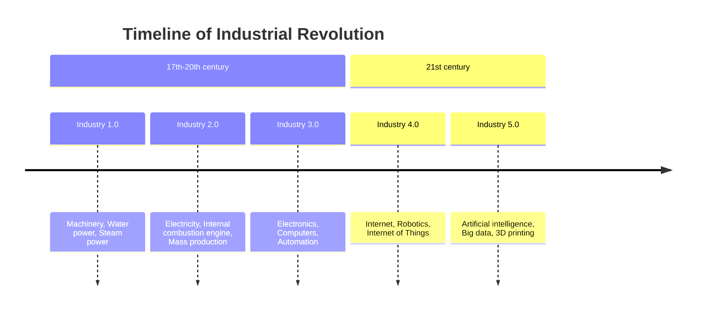
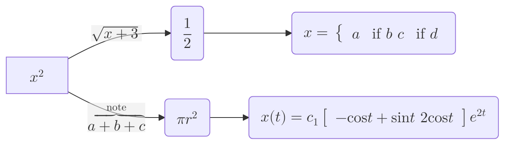
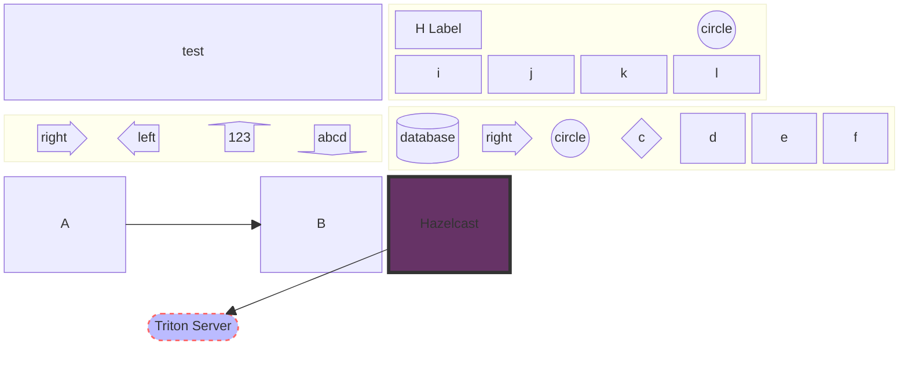
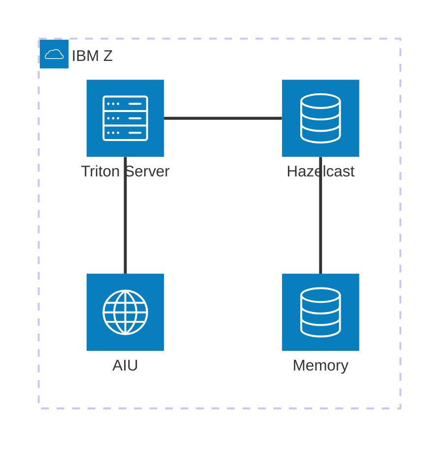

<!-- truncate -->
# testing 

## Highlight color test

<!-- Highlight coloring example: -->
<!-- worked -->
export const Highlight = ({children, color}) => (
    
        {children}
  
);

<Highlight color="#25c2a0">Docusaurus green</Highlight> and <Highlight color="#1877F2">Facebook blue</Highlight> are my favorite colors.
		
I can write **Markdown** alongside my _JSX_!

<!-- another Highlight coloring example: -->

Red
Blue
Green
Yellow

<!-- ****** -->

## image URL test

#### TIMS pricing 

<!-- ****** -->

## Admonitions test

<!-- Admonitions testing -->
<!-- worked -->
:::note
    Some **content** with _Markdown_ `syntax`. Check [this `api`](#).
:::

:::tip
    Some **content** with _Markdown_ `syntax`. Check [this `api`](#).
:::

:::info
    Some **content** with _Markdown_ `syntax`. Check [this `api`](#).
:::

:::warning
    Some **content** with _Markdown_ `syntax`. Check [this `api`](#).
:::

:::danger
    Some **content** with _Markdown_ `syntax`. Check [this `api`](#).
:::

<!-- ****** -->

## mermaid testing

<!-- worked -->

<!-- worked -->
## Timeline test

<!-- ****** -->

<!-- tab testing -->
<!-- worked -->
## Tabs test

import Tabs from '@theme/Tabs';
import TabItem from '@theme/TabItem';

<Tabs>
    <TabItem value="apple" label="Apple" default>
        This is an apple 🍎
    </TabItem>
    <TabItem value="orange" label="Orange">
        This is an orange 🍊
    </TabItem>
    <TabItem value="banana" label="Banana">
        This is a banana 🍌
    </TabItem>
</Tabs>

## Another tab test 

<Tabs
     defaultValue="apple"
     values={[
	    {label: 'Apple', value: 'apple'},
	    {label: 'Orange', value: 'orange'},
	    {label: 'Banana', value: 'banana'},
    ]}>
     <TabItem value="apple">This is an apple 🍎</TabItem>
     <TabItem value="orange">This is an orange 🍊</TabItem>
     <TabItem value="banana">This is a banana 🍌</TabItem>
</Tabs>

<Tabs groupId="operating-systems">
  <TabItem value="win" label="Windows">Use Ctrl + C to copy.</TabItem>
  <TabItem value="mac" label="macOS">Use Command + C to copy.</TabItem>
</Tabs>

<Tabs groupId="operating-systems">
  <TabItem value="win" label="Windows">Use Ctrl + V to paste.</TabItem>
  <TabItem value="mac" label="macOS">Use Command + V to paste.</TabItem>
</Tabs>

<!-- ****** -->

<!-- math testing -->
## Math test 

<!-- block-beta testing 
https://mermaid.js.org/syntax/block.html
-->
## block-beta test 

<!-- other options
id1[("database")] id2(("circle")) id3("box") id4(["block"]) id5>"asymmetric"] id6["P details"] id7{"rhombus"} id8[["double box"]]
blockArrowId5<["right"]>(right)
blockArrowId5<["left"]>(left)
---->

<!-- didn't work --

## Math equation

import remarkMath from 'remark-math';
import rehypeKatex from 'rehype-katex';
export default {
  presets: [
    [
      '@docusaurus/preset-classic',
      {
        docs: {
          path: 'docs',
          remarkPlugins: [remarkMath],
          rehypePlugins: [rehypeKatex],
        },
      },
    ],
  ],
};

$$
I = \int_0^{2\pi} \sin(x)\,dx
$$

<!-- ****** -->

<!-- ****** -->
